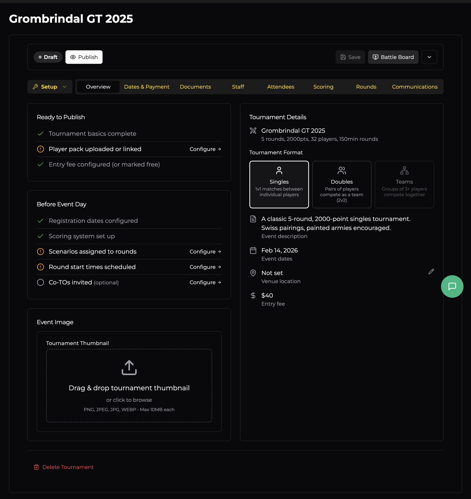

# Overview

After creating your tournament you'll land on the **Overview** tab. Think of this as your tournament dashboard — it shows you what's done, what still needs attention, and a summary of the key details.

## Status & Modes

At the top of the page you'll see two key controls:

- **Draft / Publish** — Your tournament starts in **Draft** mode (invisible to the public). When everything is configured, hit **Publish** to make it live on OWR. You can toggle back to Draft at any time.
- **Setup / Battle Board** — **Setup** is where you configure everything before the event. **Battle Board** is the game-day interface for running rounds, entering results, and managing pairings. More on that later.

## Ready to Publish Checklist

This section tracks the minimum requirements before your event can go live:

| Item | What it means |
|------|---------------|
| **Tournament basics complete** | Name, format, points, and rounds are set. |
| **Player pack uploaded or linked** | A PDF player pack has been attached via the Documents tab. |
| **Entry fee configured (or marked free)** | You've set a price or confirmed the event is free in Dates & Payment. |

Green ticks mean you're good. Orange circles mean there's still something to do — click **Configure** to jump straight to the relevant tab.

## Before Event Day Checklist

These items aren't required to publish, but you'll want them sorted before dice start rolling:

| Item | What it means |
|------|---------------|
| **Registration dates configured** | Open/close dates are set so players know when they can sign up. |
| **Scoring system set up** | Battle points, sports scores, painting scores, etc. are configured in the Scoring tab. |
| **Scenarios assigned to rounds** | Each round has a scenario (mission) assigned. |
| **Round start times scheduled** | Players can see when each round kicks off. |
| **Co-TOs invited** *(optional)* | Additional Tournament Organisers have been added via the Staff tab. |

## Tournament Details

The right-hand panel shows a summary of your event:

- **Name and format** (Singles / Doubles / Teams)
- **Key stats** — rounds, points, player cap, round time
- **Description** — your event blurb
- **Dates**
- **Venue location** (with an edit button to update)
- **Entry fee**

## Event Image

Below the checklists you can upload or change your tournament thumbnail. This image appears in event listings and search results.

## Delete Tournament

Right at the bottom there's a **Delete Tournament** link. This permanently removes the event — use with caution. Only available while the event is in Draft status.
