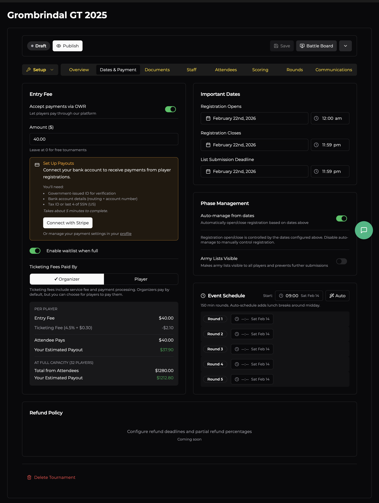

# Dates & Payment

This tab covers everything money- and calendar-related: entry fees, registration windows, round scheduling, and payment processing.

## Entry Fee

### Accept Payments via OWR

Toggle this on to let players pay directly through the platform. OWR uses **Stripe** under the hood — you'll need to connect your bank account (takes about 5 minutes). The setup wizard walks you through it, or you can manage payment settings from your profile.

If you prefer to handle payments outside OWR (e.g. bank transfer, cash on the day), leave this off and set the amount to **$0**.

### Ticketing Fees

When payments are enabled, there's a small service + processing fee (4.5% + $0.30 per ticket). You choose who absorbs it:

| Who pays | What happens |
|----------|-------------|
| **Organiser** *(default)* | The player pays the listed entry fee. The fee is deducted from your payout. |
| **Player** | The fee is added on top of the listed entry fee at checkout. |

The breakdown below the toggle shows exactly what players pay and what you receive — both per-player and at full capacity.

### Waitlist

Enable **waitlist when full** to let players join a queue once the player cap is reached. If someone drops out, the next person on the waitlist gets offered their spot.

## Important Dates

Three key dates control the registration lifecycle:

| Date | Purpose |
|------|---------|
| **Registration Opens** | When the "Register" button becomes active on your event page. |
| **Registration Closes** | Deadline for new sign-ups. |
| **List Submission Deadline** | Cut-off for players to submit or update their army lists. |

Each date includes a time picker so you can set precise cut-offs (e.g. lists due by 11:59 PM the night before).

## Phase Management

### Auto-manage from dates

When enabled (the default), OWR automatically opens and closes registration based on the dates above. Disable this if you want to manually control when registration opens/closes — useful if you need to pause sign-ups temporarily or extend a deadline.

### Army Lists Visible

Flipping this on makes all submitted army lists visible to every registered player and locks further submissions. Typically you'd enable this after the list submission deadline, so everyone can study their opponents' lists before the event.

## Event Schedule

Set your **start time** for the first round, and OWR auto-schedules the rest based on your round time (configured during creation). The scheduler is smart about lunch breaks — it inserts them around midday automatically.

You can manually adjust individual round start times if your schedule doesn't follow a regular pattern (e.g. a shorter round 1, extended lunch, late start on day 2).

Each round shows its scheduled date and time. For multi-day events, rounds will span across your event dates.

## Refund Policy

*(Coming soon)* — This section will let you configure refund deadlines and partial refund percentages for cancellations.
