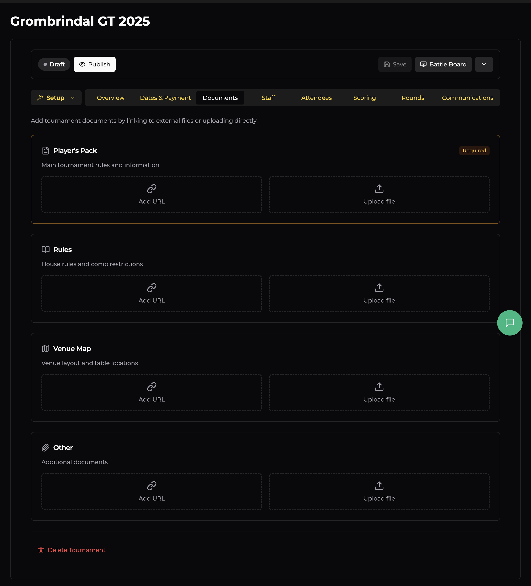

# Documents

The Documents tab is where you attach all the files your players need — player packs, house rules, venue maps, and anything else. Each document can be either uploaded directly or linked via URL.

## Document Categories

### Player's Pack *(Required)*

Your main tournament document — the one players need to read before the event. This typically includes the event schedule, army construction rules, scoring breakdown, and any house rules or comp restrictions.

This is the only **required** document. It satisfies the "Player pack uploaded or linked" item on the Overview checklist and must be provided before you can publish your event.

### Rules

House rules and comp restrictions. If your event modifies the base game rules (e.g. banned units, custom magic item limits, or composition scoring), put them here. Separating these from the player pack makes them easier to find and reference.

### Venue Map

Venue layout and table locations. Helpful for larger events where players need to find their assigned table quickly. Can be anything from a quick sketch to a detailed floor plan.

### Other

A catch-all for anything else — parking info, accommodation suggestions, nearby food options, painting rubrics, or prize breakdowns.

## Adding Documents

Each category offers two options:

- **Add URL** — Link to an external document (Google Drive, Dropbox, your club's website, etc.). The link appears on your event page for players to click through.
- **Upload file** — Upload the file directly to OWR. Players can download it from your event page.

You can add multiple documents per category if needed.
