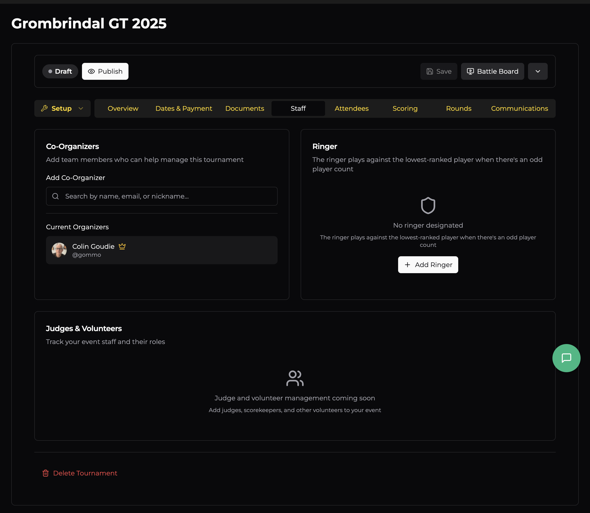

# Staff

The Staff tab lets you bring other people on board to help run your event. Whether you need a co-TO to help with pairings or a ringer for odd player counts, this is where you set them up.

## Co-Organisers

Add team members who can help manage the tournament. Co-TOs get access to the same setup and game-day tools as the primary organiser — they can manage attendees, enter results, adjust pairings, and more.

To add a co-organiser, search by **name, email, or nickname**. They must have an OWR account. Once added, they'll appear under **Current Organizers** alongside you.

This is useful for events with multiple TOs, or if you want someone else to be able to manage things if you're busy playing a game or handling something at the venue.

## Ringer

The ringer is a designated player who steps in when there's an **odd number of players** in a round. Rather than giving someone a bye, the ringer plays against the lowest-ranked player, keeping every game a real contest.

Click **+ Add Ringer** and search for the player. The ringer doesn't need to be registered for the event — they just need an OWR account. Typically this is one of the TOs or a volunteer who's happy to play casual games as needed.

If you don't designate a ringer, odd rounds will use byes instead.

## Judges & Volunteers

*(Coming soon)* — This section will let you track judges, scorekeepers, and other volunteers alongside their roles. For now, coordinate with your event staff outside of OWR.
