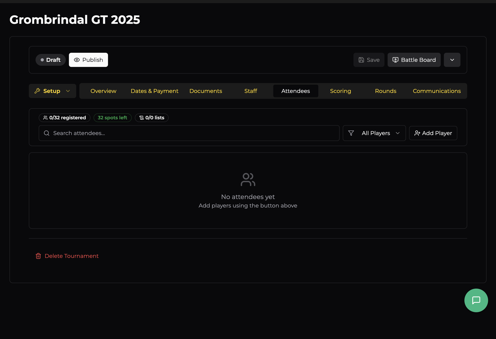

# Attendees

The Attendees tab is your player roster. It shows everyone who's registered (or been added manually), their payment and list status, and gives you tools to manage the field.

## At a Glance

The stats bar at the top gives you an instant snapshot:

- **X / Y registered** — how many players are signed up out of your player cap
- **Z spots left** — remaining capacity (shown in green while spots are available)
- **X / Y lists** — how many army lists have been submitted vs. total registered players

## Search & Filter

Use the **search bar** to find a specific player by name. The **filter dropdown** lets you narrow the list by status:

| Filter | Shows |
|--------|-------|
| **All Players** | Everyone on the roster |
| **Registered** | Confirmed attendees |
| **Checked In** | Players who've checked in on game day |
| **Waitlisted** | Players on the waitlist (when the event is full) |
| **Paid** | Players who've completed payment |
| **Unpaid** | Players who haven't paid yet |
| **Dropped** | Players who've withdrawn |
| **Refunded** | Players who've been refunded |

## Adding Players

Click **Add Player** to manually register someone. This is useful for:

- Walk-in registrations on the day
- Adding players who paid outside OWR
- Pre-registering players from an external sign-up sheet

Search for the player by name or email — they need an OWR account.

## Managing Players

Once players are registered, you can manage each one individually — update their payment status, check them in, drop them, or view/manage their army list. Player management becomes especially important on game day when you switch to the Battle Board.
