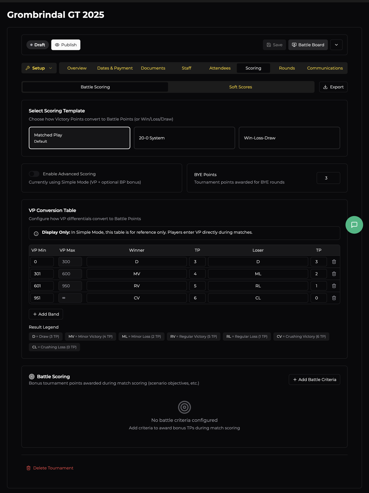
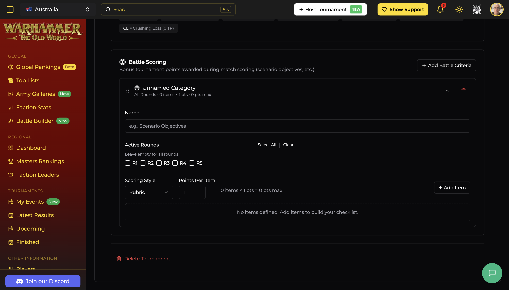
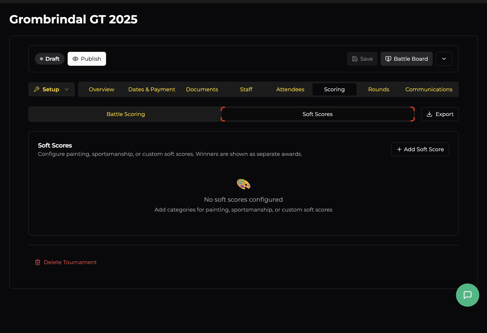

# Scoring

The Scoring tab is where you define how winners are determined. It's split into two sub-tabs: **Battle Scoring** (the core game results) and **Soft Scores** (painting, sportsmanship, etc.).

There's also an **Export** button in the top-right to download your scoring configuration.

## Battle Scoring

### Scoring Templates

Choose a template that matches how your event converts Victory Points into Tournament Points (or determines wins):

| Template | How it works |
|----------|-------------|
| **Matched Play** *(default)* | VP differentials are converted to results (Draw, Minor Victory, Regular Victory, Crushing Victory, and their loss equivalents) using a conversion table. Each result awards a set number of Tournament Points. This is the standard Warhammer: The Old World approach. |
| **20-0 System** | The VP differential maps to a sliding 20-0 scale — the winner's score and loser's score always sum to 20. Popular in many European tournament circuits. |
| **Win-Loss-Draw** | Simple binary outcomes. No VP conversion — just record who won, lost, or drew. |

### Simple vs Advanced Mode

By default, scoring runs in **Simple Mode** — players enter their Victory Points directly during matches and any bonus Battle Points are added on top. This is the easiest approach for most events.

Toggle **Enable Advanced Scoring** to switch to **Advanced Mode**, where the VP Conversion Table is used to automatically calculate Tournament Points from VP differentials. Advanced mode is useful when you want the system to handle the maths precisely.

### BYE Points

Set the number of Tournament Points a player receives for a BYE round (when they have no opponent due to an odd player count). Default is **3** — equivalent to a Draw in the Matched Play template.

### VP Conversion Table

This table defines how VP differentials map to results and Tournament Points. The default Matched Play table uses these bands:

| VP Differential | Winner Result | Winner TP | Loser Result | Loser TP |
|----------------|--------------|-----------|-------------|----------|
| 0 – 300 | Draw (D) | 3 | Draw (D) | 3 |
| 301 – 600 | Minor Victory (MV) | 4 | Minor Loss (ML) | 2 |
| 601 – 950 | Regular Victory (RV) | 5 | Regular Loss (RL) | 1 |
| 951+ | Crushing Victory (CV) | 6 | Crushing Loss (CL) | 0 |

You can customise the VP ranges, result labels, and TP values. Click **+ Add Band** to add additional tiers. The trash icon removes a band.

In **Simple Mode**, this table is for reference only — it's shown to players so they know what their VP differential means, but they enter VPs directly.

### Result Legend

Below the table, a colour-coded legend summarises all result types and their TP values at a glance:

- **D** = Draw (3 TP)
- **MV** = Minor Victory (4 TP) / **ML** = Minor Loss (2 TP)
- **RV** = Regular Victory (5 TP) / **RL** = Regular Loss (1 TP)
- **CV** = Crushing Victory (6 TP) / **CL** = Crushing Loss (0 TP)

### Battle Criteria (Bonus Points)

Below the VP table, the **Battle Scoring** section lets you add bonus Tournament Points awarded during matches — typically for scenario objectives, secondary missions, or other in-game achievements.

Click **+ Add Battle Criteria** → **New Category** to create one. Each criterion has:

| Field | Description |
|-------|-------------|
| **Name** | What this criterion is called (e.g., "Scenario Objectives") |
| **Active Rounds** | Which rounds this criterion applies to. Leave empty for all rounds. Use the R1–R5 checkboxes or Select All / Clear. |
| **Scoring Style** | How items are scored — **Rubric** (checklist of items worth set points) is the default. |
| **Points Per Item** | How many points each rubric item is worth. |

Click **+ Add Item** to build your checklist of scoreable items within the criterion.

## Soft Scores

Soft scores cover everything outside the game itself — painting quality, sportsmanship, favourite opponent voting, and any custom categories you dream up. Soft score winners are shown as **separate awards** (not mixed into the overall battle standings).

Click **+ Add Soft Score** to choose from templates or create a custom category:

| Template | Purpose |
|----------|---------|
| **Painting** | Score army presentation and painting quality |
| **Sportsmanship** | Rate opponent behaviour and game enjoyment |
| **Favorite Opponent** | Let players vote for their favourite opponent of the event |
| **Custom Category** | Define your own soft score with a custom name and scoring criteria |

Each soft score category can be configured with its own scoring rubric and point values.
