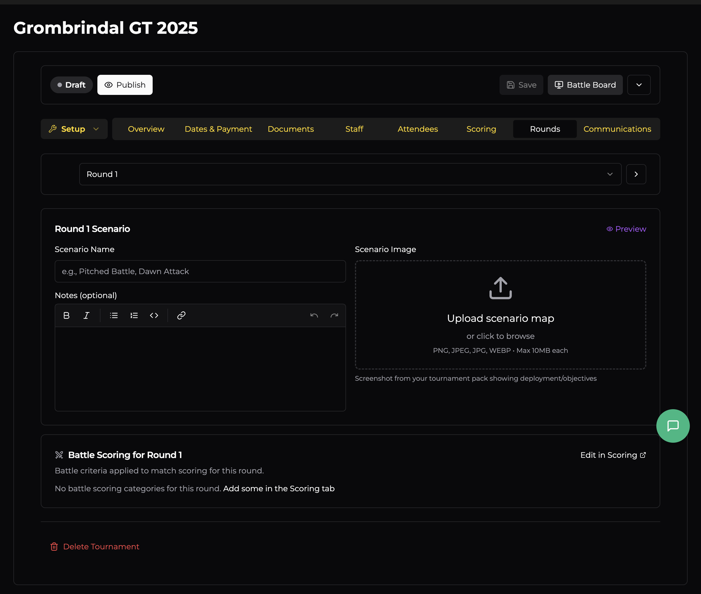

# Rounds

The Rounds tab lets you configure each round individually — assign scenarios, upload deployment maps, and add notes for players.

## Navigating Rounds

Use the **dropdown** at the top to jump to any round, or use the **arrow buttons** to step through them one at a time. Each round is configured independently.

## Round Scenario

Each round has its own scenario section with three fields:

### Scenario Name

Enter the name of the scenario (mission) for this round — e.g., "Pitched Battle", "Dawn Attack", or a custom scenario from your player pack.

### Notes (Optional)

A rich text editor for any additional information players need for the round. This supports **bold**, *italic*, lists, code blocks, and links. Use this for:

- Special deployment rules
- Scenario-specific scoring clarifications
- Table setup instructions
- Any house rules that apply to this round only

### Scenario Image

Upload a screenshot or diagram of the deployment map and objectives. This is shown to players in the Battle Board so they can quickly reference the scenario layout without digging through the player pack. Accepts PNG, JPEG, JPG, or WEBP up to 10 MB.

A **Preview** button in the top-right lets you see how the scenario will appear to players.

## Battle Scoring for Round

At the bottom, you'll see which battle scoring criteria (from the Scoring tab) apply to this round. If no criteria are configured yet, there's a link to **Add some in the Scoring tab**. You can also click **Edit in Scoring** to jump directly there.

This is a read-only summary — the actual scoring configuration lives in the Scoring tab. It's shown here so you can confirm the right criteria are active for each round.
