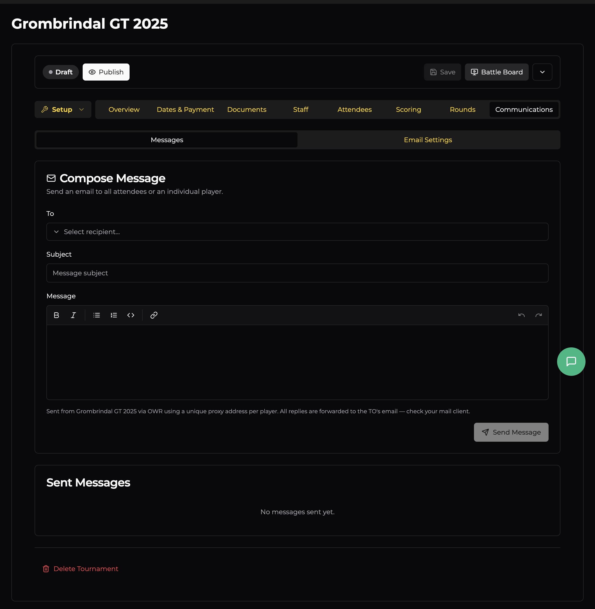
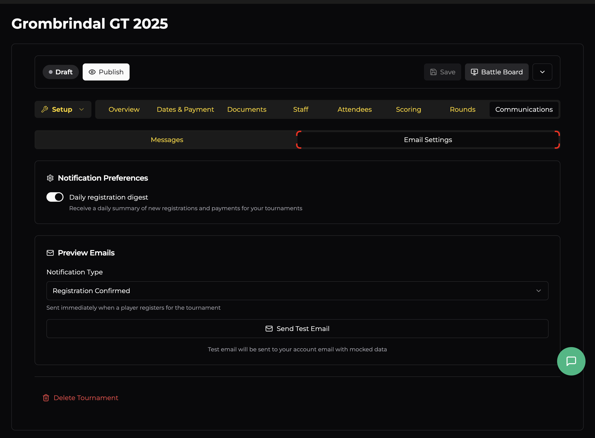

# Communications

The Communications tab lets you email your attendees and control which automated notifications get sent. It's split into two sub-tabs: **Messages** and **Email Settings**.

## Messages

### Compose Message

Send an email to all attendees or an individual player directly from OWR. No need to maintain a separate mailing list.

| Field | Description |
|-------|-------------|
| **To** | Choose a recipient — either all attendees or a specific player from the dropdown. |
| **Subject** | The email subject line. |
| **Message** | Rich text body — supports bold, italic, lists, code, and links. |

Messages are sent from your tournament via OWR using a **unique proxy email address per player**. When a player replies, the response is forwarded to the TO's email. This keeps your personal email private while still allowing two-way communication.

### Sent Messages

A log of all messages you've sent through the system. Useful for checking what's already been communicated to players.

## Email Settings

### Notification Preferences

- **Daily registration digest** — Toggle this to receive a daily summary of new registrations and payments. Handy for keeping tabs on sign-ups without checking the dashboard constantly.

### Preview Emails

Test what automated emails look like before they go out to players. Select a **Notification Type** from the dropdown and click **Send Test Email** — it sends a test to your own email with mocked data.

Available notification types:

| Notification | When it's sent |
|-------------|----------------|
| **Registration Confirmed** | When a player registers for the tournament |
| **List Reminder** | Reminder to submit army lists before the deadline |
| **List Submitted** | Confirmation when a player submits their army list |
| **Lists Visible** | When army lists are made visible to all players |
| **Waitlist Spot Available** | When a waitlisted player gets offered a spot |
| **Tournament Reminder** | Reminder before the event starts |
| **Round Pairings** | When pairings are published for a round |
| **Final Results** | When final tournament results are published |
| **Follower: Round Standings** | Sent to followers after each round's standings are posted |
| **Follower: Final Results** | Sent to followers when final results are published |
| **Organizer: Daily Digest** | Daily summary of registrations and payments (TO only) |
| **Organizer: Registration Alert** | Instant alert when someone registers (TO only) |
| **Organizer: Payment Alert** | Instant alert when a payment comes through (TO only) |
